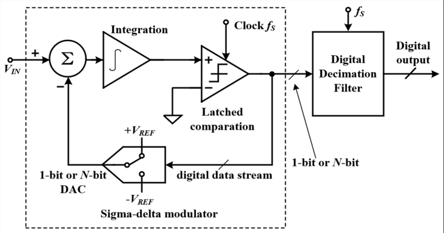
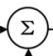
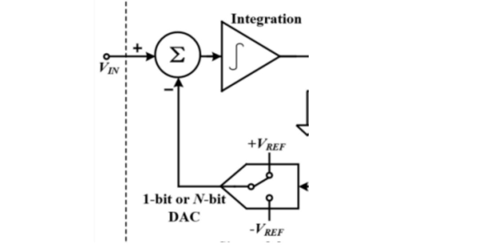
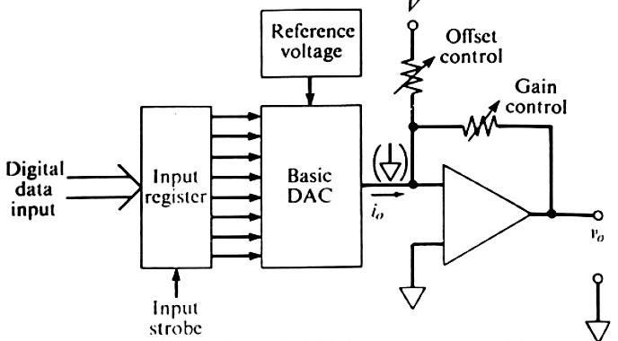
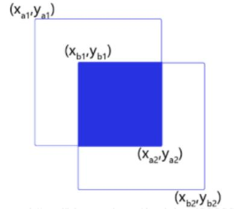

# 2025 中国研究生创“芯”大赛·EDA 精英挑战赛

## 一、赛题名称

电路系统框图识别与解析

## 二、命题单位

国家集成电路设计自动化技术创新中心

## 三、赛题背景

随着电子设计自动化（EDA）技术的飞速发展，电子工程领域的学术论文、技术报告和专利文档正变得越来越数据密集和多媒体化。这些文档不仅包含大量文字描述，还嵌入了丰富的系统框图图片（如电路逻辑图、架构示意图），用于直观展示复杂的设计原理、信号流和控制结构。例如，在一篇关于集成电路设计的论文中，系统框图可以占到整篇内容篇幅的 30%以上，它并非简单的插图，而是承载了关键的系统级信息，如模块互连、时序控制和性能指标。然而，现有的大模型（如大语言模型 LLM或视觉模型）在解析这些多模态数据时表现不足：大语言模型虽能处理文本信息，但对图片内容视而不见；纯视觉模型虽可识别图像元素，却无法结合上下文文本深度理解逻辑语义；这种割裂导致模型在自动摘要、设计验证或知识检索等应用中出现高错误率，如错误解读框图路径或忽略关键模块依赖。据统计，人工标注师在解析此类文档时消耗时间长（平均每页需 15-20 分钟），且由于专业门槛高，易出现主观偏差。如果大模型能实现高效的图文协同理解，它可大幅加速 EDA 设计周期，例如自动生成设计报告、辅助电路优化或支持智能教育工具，最终推动电子创新。

该赛题的核心挑战在于如何让模型不仅“看图识物”，还能“融图入文”：既要学习系统框图的视觉特征（如模块布局、连线类型），这需要多模态模型在预训练阶段吸收海量文档数据，通过注意力机制融合图文表示，并在下游任务中推广到多样场景。又要解析系统框图的逻辑特征（如组件功能解析，连接关系判定），这需要多模态模型对系统框图进行分析，用于回答所给出的问题。然而，当前开源模型在此领域数据稀缺（缺乏标注的多模态文档库）、架构不成熟（融合层效率低），导致泛化能力弱、多模态问题推理能力差。本赛题旨在填补这一缺口，激励参赛者开发创新模型，促进 AI 在 EDA 中的实际落地。最终，赛题的成功将为工业界和学术界提供开源工具，减少人工成本，提升设计可靠性和创新速度，并为 AI 通用图文理解能力开辟新径。

## 四、赛题描述

在集成电路（IC）设计的宏伟蓝图中，系统级框图作为一种高度抽象的视觉语言，是架构师思想的结晶，承载着整个芯片的核心功能、模块划分与数据流向。然而，随着设计日益复杂，海量的存量设计文档（尤其是图像格式的框图）形成了一座巨大的“信息孤岛”，其分析、验证、迁移和复用高度依赖人工，成为制约设计迭代效率和智能化的瓶颈。

本赛题聚焦于人工智能与 IC 设计的交叉前沿领域，致力于运用多模态大模型（VLMs）攻克一项关键挑战：从系统级框图图像中，自动化地解析其拓扑结构与逻辑关系，实现非结构化视觉信息到结构化设计知识的精准转换。

本赛题要求参赛者构建一个系统框图识别算法，该算法需具备以下核心能力：

跨模态语义认知（Cross-modal Semantic Perception）：模型不仅要“看见”框图中的视觉元素（如矩形、菱形、文本标签），更要“理解”它们所代表的 IC 设计中的具体含义，如“处理器核心”、“内存控制器”、“总线接口”等异构功能组件。

复杂拓扑结构推理（Complex Topology Reasoning）：模型需要超越简单的线条检测，精确解析组件之间错综复杂的连接关系。这包括识别点对点连接、多路复用、总线结构以及信号流向等，并能处理线条交叉、遮挡、断点等视觉噪声。

逻辑拓扑的结构化重建（Structured Reconstruction of Logical Topology）：最终目标并非零散的识别框和线段列表，而是要将识别出的所有组件（作为逻辑节点）和连接关系（作为逻辑边）进行系统性整合，重建为一个完整且精确的结构化数据模型（Structured Data Model）。该模型需清晰地定义每一个组件的属性（如功能类别、文本标识）以及组件间的连接拓扑关系。此输出必须与基准真值（Ground Truth）标签文件中的数据，在组件和连接关系两个维度上，均实现严格的、无歧义的一一对应（strict and unambiguous one-to-one mapping），确保解析结果的绝对保真度。

系统框图逻辑解析（Logical Analysis of System Block Diagram）：目标是全面分析与推理系统框图中的图文信息，通过整合视觉元素与文本描述，精准理解框图所表达的设计逻辑与功能意图。最终，模型需能够基于这些信息，准确回答与框图相关的逻辑推理问题，验证其对系统框图的整体理解能力。

赛题属于集成电路领域。具体描述为给定一组不同结构的逻辑电路系统框图和描述系统框图中组件与组件之间连接关系的标签，如何使用 CV 算法，同时结合多模态大模型将尽可能多的组件和连接关系识别出来，并与标签文件中的数据一一匹配，同时完成所给出的逻辑分析问题。

**赛题数据**：

赛题为参赛队伍提供 1000 张系统框图，其中 20 张系统框图含有标签数据，作为测试集；对于未标注的训练数据，可利用现有的多模态大模型得到一些初步的标注。同时，允许参赛队伍自行搜集其它数据进行模型的训练。

**输入**：

一个电路系统框图，如图 1


图1

这是一个标准的电路系统框图，赛题目标为利用 CV 算法，同时结合多模态大模型对图形进行识别，以生成尽可能多且精确的组件信息，并完成赛题所指定的任务。

**输出**：

### 任务一（60%）

在任务一部分，本赛题将模型的输出分为三个阶段：组件提取、组件输入输出端口数量匹配、连接关系提取。

**（1）组件提取**：识别出图片中的组件名称及位置信息，按照规定格式给出。组件定义：电路图中的元器组件，在图中显示为图标。

输出格式：{[Component: "A",pos: ["x1","y1","x2","y2"]}

其中，Component 为组件的名称，严格按照图中的组件昵称来命名，若无名称则使用组件的类型进行命名；pos 中的["x1","y1","x2","y2"]分别为图形 IoU 计算时 box 的[左上角的 x，左上角的 y，右下角的 x，右下角的 y]（x,y 均取像素值）。

**（2）组件输入输出端口数量提取**：对每个组件进行分析，统计每个组件的输入和输出端口数量，并生成一个序列。

组件输入输出端口定义：用于接收指向目标组件和目标组件发送指向其他组件的连接关系的平台，如用于→，--的端口，指向目标组件的平台为输入端口，从目标组件发送给其他组件的平台为输出端口。

输出格式：例如图形  含有两个输入端口，一个输出端口，那么它的端口信息则为I_O:{Component:∑,input:2,output:1}。

**（3）连接关系提取**：识别组件与组件之间的连接关系，并按照指定格式给出。连接关系定义：组件和组件联系的箭头或者其他指向性符号。输出格式：


图2

使用大模型生成组件连接关系，假定有组件连接关系“A→B，B→C”，那么组件B 的连接关系表达形式为：[input：["A"] ; output：["C"]]，例如在图 2 中，对于组件∑有连接关系[input：["V IN","1-bit or N-bit DAC"];output["Integration"]]。

**（4）最终结果**：
最终结果将按照 Json 格式输出。（注：module 指的是每一张参与模型识别的系统框图，一个图片则用一个 module 来记录内部组件信息。Component 为单个组件的名称，Pos 是组件进行 IoU 计算时的BOX坐标，I_O 是组件的输入输出端口，Connection 是组件与其他组件之间的连接关系。）

```text
{
    "Component": "B",
    "Pos": ["x1", "y1", "x2", "y2"],
    "I_O": {
        "input": 1,
        "output": 1
    },
    "Connection": {
        "input": ["A"],
        "output": ["C"]
    }
},
{
    "Component": "E",
    "Pos": ["x1", "y1", "x2", "y2"],
    "I_O": {
        "input": 2,
        "output": 2
    },
    "Connection": {
        "input": ["C", "D"],
        "output": ["F", "G"]
    }
}
```

### 任务二（40%）

在任务二部分，本赛题要求参赛队伍结合多模态大模型，对赛题给出的模拟电路问题进行推理回答，推理出尽可能多且正确的 QA 问答对。

其中，在选择题部分，模型需要预测出一个选项，当预测选项与答案选项一一对应时即可获得分数；在填空题部分，只有当模型预测的结果与正确答案完全匹配时，才可获得相应的分数。

**QA 对生成**：

本部分将给出模拟电路常识/模拟电路分析的相关问题，要求多模态大模型对问题进行分析，给出预测答案，并与正确答案进行比对，以生成准确率。具体生成格式如下：

**例**：

对于图 3，有相关问题如下：


图3

**选择题：**

1. 考虑图中 Basic DAC 的电流输出经由可调反馈电阻 $R_f$（Gain control）输入运算放大器反相端，且反相输入节点存在等效电容 $C_{in}$。以下叙述中，哪一项正确描述了闭环带宽 $f_c$ 随增益控制（反馈电阻值）的变化关系？

A. 无论 $R_f$ 取何值，闭环带宽均保持不变，因为 Op Amp 的开环带宽主导响应。
B. 随着 $R_f$ 增大，闭环带宽减小，大致满足 $f_c \approx \frac{1}{2\pi R_f C_{in}}$ 的反比关系。
C. 随着 $R_f$ 增大，闭环带宽增大，因为更高的增益有利于高频响应。
D. 随着 $R_f$ 增大，闭环带宽先增大后减小，呈非单调变化，这是由于增益控制与 Offset control 耦合造成的。

**答案：B**

若模型预测答案为 C，则视为匹配错误，无法获得相应分数。

2. 基于图中所示电路，假设 Basic DAC 的输出电流为 $I_o$，偏置电位器 Offset control 的端到端电阻中，连接至参考电压 $V_+$ 与运放反相输入节点之间的等效电阻为 $R_{off}$，反馈电阻 Gain control 为 $R_f$，则输出电压 $v_o$ 与 $I_o$、$V_+$、$R_f$ 和 $R_{off}$ 之间的关系，下列哪一项正确？

A. $v_o = -I_o R_f + \frac{V_+}{R_{off}} R_f$

B. $v_o = -I_o R_f - \frac{V_+}{R_{off}} R_f$

C. $v_o = I_o R_f - \frac{V_+}{R_{off}} R_f$

D. $v_o = I_o R_f + \frac{V_+}{R_{off}} R_f$

**答案：B**

若模型预测答案为 B，则视为匹配正确，可获得相应分数。

**填空题：**

考虑图中 Basic DAC 的电流输出经由可调反馈电阻 $R_f$（Gain control）输入运算放大器反相端，且反相输入节点存在等效电容 $C_{in}$。

请回答：随着 $R_f$ _____，闭环带宽减小。

**答案：增大**

若模型预测结果为增大，则视为匹配成功，可获得相应分数。

## 五、评分标准

**（1）约束条件**

如参赛队伍使用 VLM，要求参赛队伍使用的推理大模型类型为：Qwen2.5-VL-3B，Adapter 参数量应少于 1B，总计算模型参数应小于 4B。使用其他大模型参与将视为无效参赛。注意：该要求仅限于测试过程。

**（2）评分方式**

设置几个参数，用于计算 F1 分数：

TP（True Positive）：被正确预测的正例。即该数据的真实值为正例，预测值也为正例的情况；

TN（True Negative）：被正确预测的反例。即该数据的真实值为反例，预测值也为反例的情况;

FP（False Positive）：被错误预测的正例。即该数据的真实值为反例，但被错误预测成了正例的情况；

FN（False Negative）：被错误预测的反例。即该数据的真实值为正例，但被错误预测成了反例的情况。

根据赛题设定的输出部分，本赛题以加权平均的形式为每位参赛队伍赋分。假定S1,S2,S3 分别为参赛者在输出(1),(2),(3)中的得分，其中，S1,S2,S3 的分数设定不同的得分点，每正确匹配一次数据将得到相应的分数。

### 任务一（60%）

**组件提取评分标准 $\text{S}_1$ ：**

匹配 `box:{[Component: ,pos: ],[...]}` 中的位置信息，根据目标检测参数 IoU（交并比）来进行计算，当 IoU $\ge$ 0.5 时视为位置匹配正确。如果存在多个 IoU $\ge$ 0.5 的预测框对应同一个标签框，则取 IoU 最高的组件作为匹配组件。

**图 4 IoU 计算方式**



相交部分左上角坐标为：
$$x_1 = \max(x_{a1}, x_{b1}), \quad y_1 = \max(y_{a1}, y_{b1})$$
相交部分右下角坐标为：
$$x_2 = \min(x_{a2}, x_{b2}), \quad y_2 = \min(y_{a2}, y_{b2})$$
交集面积计算：
$$intersection = \max(x_2 - x_1 + 1.0, 0) \cdot \max(y_2 - y_1 + 1.0, 0)$$
两个框的面积：
$$S_A = (x_{a2} - x_{a1} + 1.0) \cdot (y_{a2} - y_{a1} + 1.0)$$
$$S_B = (x_{b2} - x_{b1} + 1.0) \cdot (y_{b2} - y_{b1} + 1.0)$$
并集面积：
$$union = S_A + S_B - intersection$$
IoU 计算：
$$\text{IoU} = \frac{intersection}{union}$$

根据匹配结果定义以下参数：
*   **TP (True Positive)**：正确匹配的位置数量（IoU $\ge$ 0.5）。
*   **Total_Label**：标签文件（Label）中的组件总数。
*   **Total_Pred**：模型生成的组件预测总数。

则位置匹配评分计算公式为：
精准度：$\text{Precision}_P = \frac{TP}{Total\_Pred}$
召回率：$\text{Recall}_P = \frac{TP}{Total\_Label}$
位置匹配评分：$S_P = 2 \times \frac{(\text{Precision}_P \times \text{Recall}_P)}{(\text{Precision}_P + \text{Recall}_P)}$

完成对 $S_P$ 的计算后，对位置匹配成功的组件进行名称匹配。使用文本编辑距离或词向量相似度方法，若相似度大于固定阈值，则视作名称匹配正确。(score.py代码中暂时未实现)

*   **TP_N**：在位置匹配成功的组件中，名称匹配正确的数量。
*   **Total_Label**：标签中的组件总数。
*   **Total_Pred**：模型生成的预测总数。

名称匹配评分计算公式为：
精准度：$\text{Precision}_N = \frac{TP\_N}{Total\_Pred}$
召回率：$\text{Recall}_N = \frac{TP\_N}{Total\_Label}$
名称匹配评分：$S_N = 2 \times \frac{(\text{Precision}_N \times \text{Recall}_N)}{(\text{Precision}_N + \text{Recall}_N)}$

那么组件提取的最终评分 $S_1$ 公式如下：
$$S_1 = \frac{(S_N + S_P)}{2}$$

**组件输入输出端口数量匹配评分标准 $\text{S}_2$ ：**

匹配 `I_O:{[Component: ,input: ,output: ,],[...]}` 中每个组件的端口数量。仅当一个组件的输入端口数与输出端口数均与标签完全匹配时，计为正确匹配（TP）。

*   **TP**：输入与输出端口均匹配正确的组件数量。
*   **Total_Label**：标签中含有端口信息的组件总数。
*   **Total_Pred**：模型生成的含有端口信息的预测总数。

计算公式为：
精准度：$\text{Precision} = \frac{TP}{Total\_Pred}$
召回率：$\text{Recall} = \frac{TP}{Total\_Label}$
输入输出端口数量匹配评分 $S_2$ 为：
$$S_2 = 2 \times \frac{(\text{Precision} \times \text{Recall})}{(\text{Precision} + \text{Recall})}$$

**连接关系提取评分标准 $\text{S}_3$ ：**

匹配每条连接关系对，如组件 E 的连接关系对 `Connection[input:["C","D"], output:["F","G"]]`。当预测组件的 input 列表和 output 列表与标签完全一致（不计顺序）时，计为正确匹配（TP）。

*   **TP**：正确匹配连接关系的组件数量。
*   **Total_Label**：标签中连接关系对的总数。
*   **Total_Pred**：模型生成的连接关系对的总数。

计算公式为：
精准度：$\text{Precision} = \frac{TP}{Total\_Pred}$
召回率：$\text{Recall} = \frac{TP}{Total\_Label}$
连接关系提取评分 $S_3$ 为：
$$S_3 = 2 \times \frac{(\text{Precision} \times \text{Recall})}{(\text{Precision} + \text{Recall})}$$

---

**任务一总体评分标准 $\text{Score}_1$：**

对任务一的三部分评分进行加权计算：
$$\text{Score}_1 = S_1 \times 40 + S_2 \times 20 + S_3 \times 40$$
（注：$S_1, S_2, S_3$ 的取值范围均为 $[0, 1]$，最终 $\text{Score}_1$ 总分为 100 分）

### 任务二（40%）

**QA 问答对生成：**

计算 QA 问答对匹配的准确率，作为该部分的评分标准。

设置 T 为正确匹配，N 为错误匹配，准确率为 PQ，则有该部分的评分标准公式为：

准确率：

$$P_Q = \frac{T}{T+N}$$

任务二得分：

$$Score_2 = P_Q \times 100$$

**模型计算总分评分标准 Score：**

在计算总分的过程中，为防止极端分数造成各参赛队伍排名差距过大，赛题使用 Min-Max 归一化，将分数映射在[0,1]区间之中，其计算公式为：

$$Normalized_x = \frac{x - \min(A)}{\max(A) - \min(A)}$$

其中，x 为参赛队伍在任务 x 所得的分数，如 x1 为该参赛队伍在任务一中获得的分数。min(A)为所有参赛队伍中分数最低的值，max(A)为所有参赛队伍中分数最高的值。

对于总分的任务评分要求，有相对评分 Normalizedx1,Normalizedx2，分别对应参赛队伍在任务一和任务二中获得的相对评分。

那么评价总分的计算公式为：

$$Score = Normalized_{x1} \times 60 + Normalized_{x2} \times 40$$

**模型计算时间要求：**

模型的计算时间将会作为赛题评分的加分项，对于计算时间，有以下评分方式：

赛题按照 Benchmark 评测平均时间 AVG 来进行计算

$$AVG = \frac{sum(runtime(Benchmark1) + runtime(Benchmark2) + runtime(Benchmark3) + ...)}{count(Benchmark)}$$

评分专家对 AVG 的大小进行分析，根据表 1 给出参赛队伍在时间层面获得的分数

**表 1 计算时间评分表**

| AVG 队伍排名 | 得分情况 |
| :--- | :--- |
| 前 10% | 5 分 |
| 前 30% | 3 分 |
| 前 50% | 1 分 |
| 其他 | 0 分 |

**模型 Case 测评：**

对于模型的评测 Case，赛题设置为 Public Case 和 Hidden Case 两部分，参赛队伍可以对 Public Case 进行评测来判断模型的性能是否符合赛题要求；在参赛队伍提交模型代码后，组委会将使用 Hidden Case 对模型进行评测，进一步分析各参赛队伍的模型性能。Public Case 与 Hidden Case 的分布比例如表 3：

**表 3 模型评测 Case 分布表**

| 类型 | Public Case | Hidden Case |
| :--- | :--- | :--- |
| 比例 | 60% | 40% |

## 六、参赛要求

要求学生具有一定的 Python 语言编程能力，具有一定的逻辑电路，计算机基础。主要面向计算机、微电子、数学专业的学生，但不限于这些专业。

## 七、参考文献

学生可以借助以下参考文献查阅已有的一些研究，对现有模型进行优化。以下书目涉及集成电路知识及多模态大模型：

1. Y. Huang et al., “LayoutLMv3: Unified Text and Image Masking for Document AI,” in Proc. ACM Multimedia, 2022, pp. 1–9.

2. J. Li et al., “Qwen-VL: A Frontier Large Vision-Language Model with Versatile Abilities,” arXiv:2308.12966, 2023.

3. Chen, T., et al. “Visual Instruction Tuning: Towards General-Purpose Multimodal LLMs.” NeurIPS 2023.

4. Li, J., et al. “Blip-2: Bootstrapping Language-Image Pre-training with Frozen Image Encoders.” ICML 2023.

5. Liu, S., et al. “LLaVA-OneVision: Easy Visual Task Transfer with Only One Vision-Language Model.” arXiv:2408.03326, 2024.

6. Deng, L., et al. “Multimodal Document Intelligence: Models, Benchmarks and Challenges.” ACM Computing Surveys, 2024.

7. LayoutLLM-3B: Lightweight Multimodal Transformer for Technical Diagram Understanding arXiv:2405.13214, 2024

8. L. Wang et al., “EDA in the Era of Large AI Models: Opportunities and Challenges,”IEEE Trans. CAD, early access, 2024.

9. X. Dong et al., “Towards Efficient Large Multimodal Model Serving: A System Perspective,” arXiv:2402.14818, 2024.

10. R. Kandur, “Multimodal Large Language Models: Architectures, Challenges and Future Directions,” Int. J. Inf. Technol. Manag. Inf. Syst., vol. 16, no. 1, pp. 430–441, 2025.

11. S. Bai et al., “Qwen2.5-VL Technical Report,” arXiv preprint arXiv:2502.13923, Feb.2025.

*本赛题指南未尽问题，见赛题 Q&A 文件
